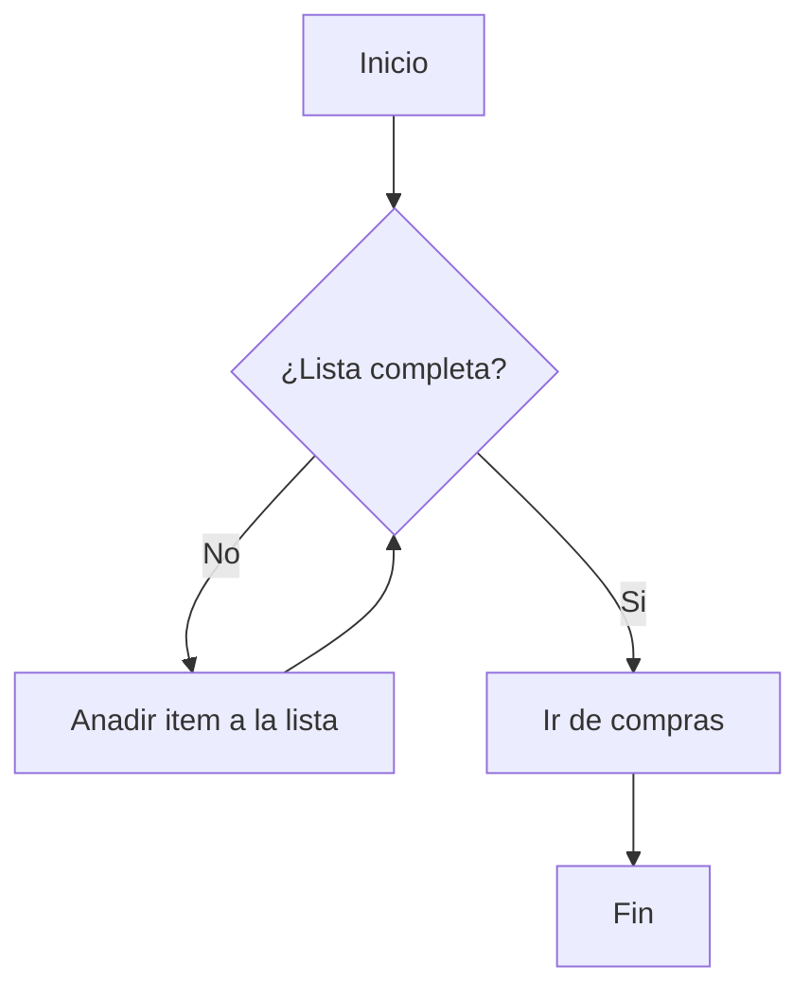
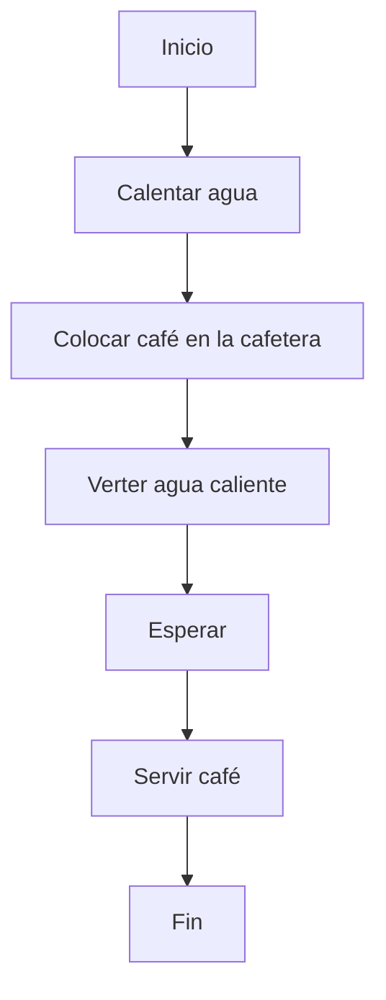
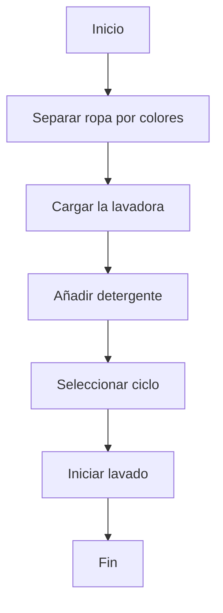
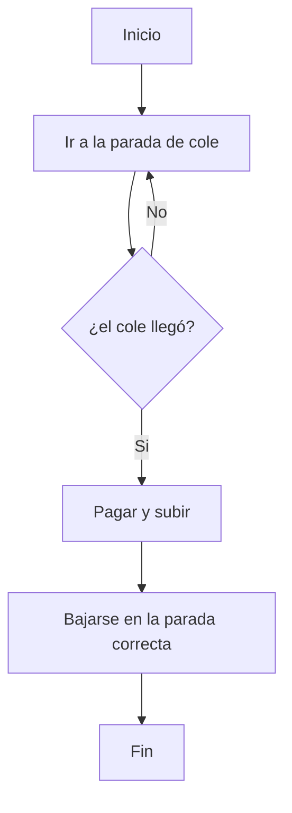
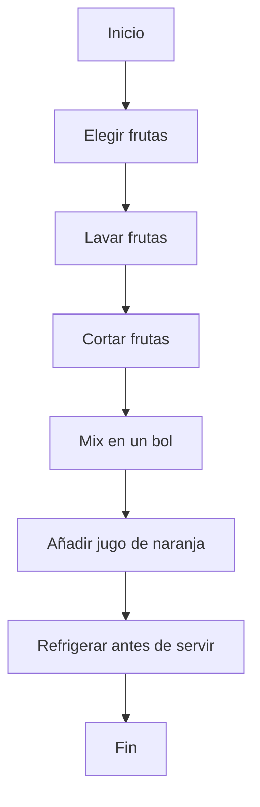

# Diagramas de flujo

## Lista de compras

```mermaid
graph TD;
    A[Inicio] --> B{¿Lista completa?}
    B -->|No| C[Anadir item a la lista]
    C --> B
    B -->|Si| D[Ir de compras]
    D --> E[Fin]

```

## Preparar un café

```mermaid
graph TD;
    A[Inicio] --> B[Calentar agua]
    B --> C[Colocar café en la cafetera]
    C --> D[Verter agua caliente]
    D --> E[Esperar]
    E --> F[Servir café]
    F --> G[Fin]
```

## Lavado de Ropa

```mermaid
graph TD;
    A[Inicio] --> B[Separar ropa por colores]
    B --> C[Cargar la lavadora]
    C --> D[Añadir detergente]
    D --> E[Seleccionar ciclo]
    E --> F[Iniciar lavado]
    F --> G[Fin]

```

## Viaje en Cole

```mermaid
graph TD;
    A[Inicio] --> B[Ir a la parada de cole]
    B --> C{¿el cole llegó?}
    C -->|No| B
    C -->|Si| D[Pagar y subir]
    D --> E[Bajarse en la parada correcta]
    E --> F[Fin]

```

## Hacer una ensalada

```mermaid
graph TD;
    A[Inicio] --> B[Elegir frutas]
    B --> C[Lavar frutas]
    C --> D[Cortar frutas]
    D --> E[Mix en un bol]
    E --> F[Añadir jugo de naranja]
    F --> G[Refrigerar antes de servir]
    G --> H[Fin]

```
